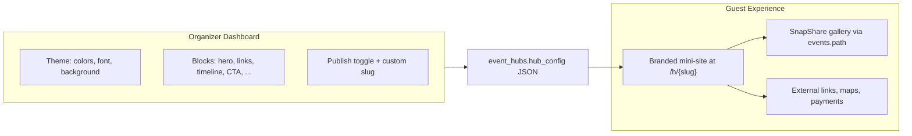
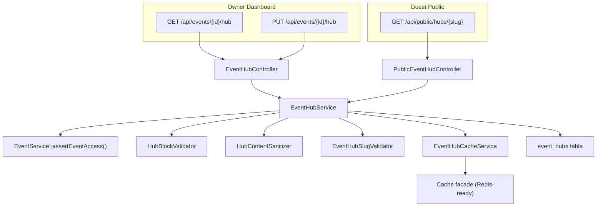
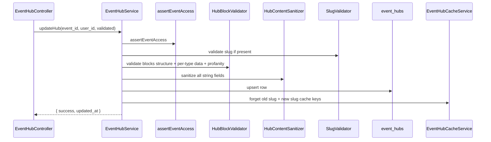

# Event Hub Backend Implementation Plan

## Product Vision

The Event Hub is each couple’s or planner’s **own branded event page** — a lightweight mini-site, not a full website builder. Organizers:

- Claim a **unique public URL** (`/h/michal-and-omer`) guests can bookmark or scan from a QR code
- **Design the page** via global theme settings (colors, background, font) plus a drag-ordered list of content blocks
- **Add their content**: couple names, cover image, schedule, navigation links, payment/blessing info, custom link lists, text sections, and curated photos
- **Embed SnapShare features** natively (e.g. selfie / face-recognition gallery CTA wired to the existing `events.path` gallery)

The backend’s job is to persist that layout safely, serve a fast filtered public view to hundreds of concurrent guests, and stay **extensible** — new block types are added via validation schemas only, not new DB tables.



**Design split:** Visual styling lives in `hub_config.theme`; all page content lives in `hub_config.blocks[]`. The frontend renders block `type` → component; the backend validates and sanitizes each block’s `data` contract.

---

## Context & Adaptations

The PRD targets PostgreSQL/UUID (`core_events`), but SnapShare uses **MySQL + bigint `events.id`**. Follow the existing Icebreaker extension pattern ([`2026_07_01_000001_create_icebreaker_configs_table.php`](database/migrations/2026_07_01_000001_create_icebreaker_configs_table.php)) rather than the PRD's raw SQL.

Per your choices:
- **Routes:** `/api/events/{event_id}/hub` (auth) + `/api/public/hubs/{slug}` (guest)
- **Response envelope:** Standard `{ message, status, data }` via [`Controller::successResponse()`](app/Http/Controllers/Controller.php)
- **Unpublished hubs:** Return **404** on the public endpoint

**Two URL concepts:**
| Field | Owner | Example | Purpose |
|-------|-------|---------|---------|
| `event_hubs.slug` | User-chosen | `michal-and-omer` | Human-readable Event Hub mini-site URL |
| `events.path` | Auto-generated | `a8Kx2mP9qR1n` | Existing SnapShare gallery / upload token |

The `SNAPSHARE_CTA` block’s frontend uses `integrations.gallery_path` from the public payload to deep-link guests into the gallery without a second API call.

---

## Architecture



---

## 1. Database Layer

**New migration:** `database/migrations/2026_07_02_000001_create_event_hubs_table.php`

| Column | Type | Notes |
|--------|------|-------|
| `event_id` | `unsignedBigInteger` PK | FK → `events.id` CASCADE |
| `slug` | `string(100)` UNIQUE | User-chosen public URL segment |
| `is_published` | `boolean` default `false` | Gates public access |
| `hub_config` | `json` | Default: `{"theme":{},"blocks":[]}` |
| `timestamps` | | |

Index: `slug` (explicit index for QR scan lookups).

**New model:** [`app/Models/EventHub.php`](app/Models/EventHub.php)
- `$fillable`: `event_id`, `slug`, `is_published`, `hub_config`
- `$casts`: `hub_config` → `array`, `is_published` → `boolean`
- `belongsTo(Event::class)`

**Extend** [`app/Models/Event.php`](app/Models/Event.php):
```php
public function hub() {
    return $this->hasOne(EventHub::class, 'event_id', 'id');
}
```

---

## 2. Enums & Config

**New enums** in `app/Services/Enums/`:

| Enum | Values |
|------|--------|
| `HubBlockTypeEnum` | See block catalog below |
| `HubBackgroundTypeEnum` | `LIGHT`, `DARK` |

### Block Catalog (v1)

Blocks are the Lego pieces organizers combine to build their page. Each has a stable `type` string and a typed `data` object validated on save.

| Block Type | User-facing purpose | SnapShare tie-in |
|------------|---------------------|------------------|
| `HERO_COUNTDOWN` | Cover image, couple/event title, countdown to date | Can default `cover_image_url` from `events.image` |
| `SNAPSHARE_CTA` | Prominent button to gallery / selfie upload | Links to `events.path` gallery (injected in public payload) |
| `EVENT_TIMELINE` | Interactive schedule (reception, chuppah, party…) | — |
| `SMART_NAVIGATION` | Venue name + Waze / Google Maps pins | — |
| `WISHING_WELL` | Cash gift / blessing info, payment link | — |
| `LINK_LIST` | **Custom labeled links** (RSVP, registry, playlist, hotel…) | — |
| `RICH_TEXT` | **Free-form text section** (our story, dress code, parking notes) | — |
| `MEDIA_STRIP` | **Curated image row** (engagement photos, venue shots) | URLs from S3 uploads or `events.image` |

Adding a block later = new enum value + `HubBlockValidator` rules + frontend component. **No migration.**

### Theme schema (`hub_config.theme`)

Organizers customize look-and-feel without touching code:

```json
{
  "primary_color": "#D4AF37",
  "secondary_color": "#FFFFFF",
  "background_type": "LIGHT",
  "font_family": "Rubik",
  "accent_image_url": "https://cdn.../optional-watermark.png"
}
```

All theme string fields go through XSS sanitization on save.

**New config:** [`config/event_hub.php`](config/event_hub.php)
- `cache_ttl` (e.g. 3600 seconds, env-overridable)
- `cache_prefix` → `hub:slug:`
- `reserved_slugs` → `['admin','api','dashboard','auth','pricing','snapshare','public','events','user','store','subscriptions']`
- `slug_max_length` → 100

---

## 3. Service Layer

Mirror the Icebreaker split ([`IcebreakerConfigService`](app/Services/Icebreaker/IcebreakerConfigService.php)).

### `EventHubService` — [`app/Services/EventHub/EventHubService.php`](app/Services/EventHub/EventHubService.php)

| Method | Responsibility |
|--------|----------------|
| `getAdminHub(int $event_id, int $user_id)` | `assertEventAccess`, return row or default scaffold |
| `updateHub(int $event_id, int $user_id, array $data)` | Validate → sanitize → persist → invalidate cache |
| `getPublicHub(string $slug)` | Cache-first read, 404 if missing/unpublished, filter pipeline |

**Default admin scaffold** (no row yet) — pre-seeds a sensible starter layout organizers can customize:

```php
[
  'event_id' => $event_id,
  'slug' => null,
  'is_published' => false,
  'hub_config' => [
    'theme' => [
      'primary_color' => '#D4AF37',
      'background_type' => 'LIGHT',
      'font_family' => 'Rubik',
    ],
    'blocks' => [
      // HERO_COUNTDOWN (enabled, order 1) — title prefilled from $event->name, date from $event->starts_at
      // SNAPSHARE_CTA (enabled, order 2) — default button text
    ],
  ],
  'updated_at' => null,
]
```

On first `GET` admin, load the parent `Event` to populate hero defaults from `name`, `starts_at`, and `image`.

**Public filter pipeline** (in service, before cache write and on cache miss):
1. Reject if `!is_published` → throw 404 (`MessagesEnum::EVENT_HUB_NOT_FOUND`)
2. Filter `blocks` where `enabled === true`
3. Sort ascending by `order`
4. Strip `enabled` from each block in public payload
5. Attach **`integrations`** object so the frontend can wire SnapShare without extra calls:

```json
{
  "event_id": 42,
  "event_name": "Michal & Omer",
  "theme": { ... },
  "blocks": [ ... ],
  "integrations": {
    "gallery_path": "a8Kx2mP9qR1n",
    "gallery_url": "/a8Kx2mP9qR1n",
    "icebreaker_enabled": false
  }
}
```

`icebreaker_enabled` is a boolean derived from `event.icebreakerConfig.status === ACTIVE` (read-only hint for frontend; no icebreaker data leaked).

Return shape: `{ event_id, event_name, theme, blocks, integrations }` — no raw `hub_config`, no `is_published`.

### `HubBlockValidator` — [`app/Services/EventHub/HubBlockValidator.php`](app/Services/EventHub/HubBlockValidator.php)

Structural rules (Form Request + service):
- Every block requires: `id`, `type`, `enabled`, `order`, `data`
- `type` must be in `HubBlockTypeEnum`
- `order` values must be **sequential integers starting at 1** with no gaps (e.g. `[1,2,3]`)
- Block `id` must be unique within the array
- Per-type `data` schemas:

| Block Type | Required `data` fields | Optional |
|------------|------------------------|----------|
| `HERO_COUNTDOWN` | `title`, `event_date` | `cover_image_url` (url) |
| `SNAPSHARE_CTA` | `button_text` | `subtitle` |
| `EVENT_TIMELINE` | `items` (array, min 1) | Each item: `time`, `label`, `description` |
| `SMART_NAVIGATION` | `location_name` | `waze_url`, `google_maps_url` (url) |
| `WISHING_WELL` | `title` | `message`, `payment_link` (url), `account_details` |
| `LINK_LIST` | `links` (array, min 1) | Each link: `label` (required), `url` (required, url), `icon` (optional string) |
| `RICH_TEXT` | `heading`, `body` | `alignment` (`LEFT`/`CENTER`) |
| `MEDIA_STRIP` | `images` (array, min 1) | Each image: `url` (required, url), `caption` (optional) |

**Image/asset URLs:** Validate with Laravel `url` rule (max 2048). URLs are typically S3/CDN paths from existing SnapShare uploads (`FileService` / gallery assets). No new asset upload endpoint in this phase — organizers paste or pick URLs the dashboard already manages.

Run profanity check on all free-text fields via existing [`ProfanityFilterService`](app/Services/Moderation/ProfanityFilterService.php) (same pattern as Icebreaker profiles).

### `HubContentSanitizer` — [`app/Services/EventHub/HubContentSanitizer.php`](app/Services/EventHub/HubContentSanitizer.php)

**New dependency:** `stevebauman/purify` (HTMLPurifier wrapper) — not currently in [`composer.json`](composer.json).

Recursively walk `hub_config` (theme + all block `data` strings):
- Strip/neutralize `<script>`, `javascript:`, event handlers, etc.
- Preserve plain text and safe formatting
- Called in `updateHub()` **before** DB persist

### `EventHubSlugValidator` — [`app/Services/EventHub/EventHubSlugValidator.php`](app/Services/EventHub/EventHubSlugValidator.php)

When `slug` is provided/changed:
- Regex: `^[a-zA-Z0-9\-_]+$`
- Length: 3–100
- Not in `config('event_hub.reserved_slugs')` (case-insensitive)
- Unique in `event_hubs.slug` (exclude current `event_id` on update)
- Optional safety: reject if slug collides with an existing `events.path` value

### `EventHubCacheService` — [`app/Services/EventHub/EventHubCacheService.php`](app/Services/EventHub/EventHubCacheService.php)

First cache layer in the codebase with **explicit invalidation** (new pattern, follows existing `Cache::put/has/forget` style from [`GoogleAuthService`](app/Services/Auth/GoogleAuthService.php)):

```php
// Key: config('event_hub.cache_prefix') . $slug  →  "hub:slug:michal-and-omer"
Cache::remember($key, $ttl, fn() => $filteredPublicPayload);
Cache::forget($key); // on PUT, including old slug if changed
```

Only cache **filtered public payloads** for published hubs. Do not cache 404s (avoid stale negative cache on first publish).

---

## 4. HTTP Layer

### Routes

**[`routes/groups/event_hub.php`](routes/groups/event_hub.php)** — register under `api/events`:
```php
Route::group(['middleware' => 'auth:api'], function () {
    Route::get('{event_id}/hub', [EventHubController::class, 'show']);
    Route::put('{event_id}/hub', [EventHubController::class, 'update']);
});
```

**[`routes/groups/public.php`](routes/groups/public.php)** — new group:
```php
Route::get('hubs/{slug}', [PublicEventHubController::class, 'show']);
```

Register in [`RouteServiceProvider.php`](app/Providers/RouteServiceProvider.php):
```php
Route::prefix('api/public')->group(base_path('routes/groups/public.php'));
Route::prefix('api/events')->group(base_path('routes/groups/event_hub.php'));
```

Consider adding `throttle:120,1` on the public route for QR-scan bursts (configurable).

### Controllers

| Controller | Methods |
|------------|---------|
| [`EventHubController`](app/Http/Controllers/EventHubController.php) | `show`, `update` — thin, try/catch, `Auth::user()->id` |
| [`PublicEventHubController`](app/Http/Controllers/PublicEventHubController.php) | `show` — no auth |

### Form Request

[`UpdateEventHubRequest`](app/Http/Requests/UpdateEventHubRequest.php):
```php
'slug'          => 'nullable|string|max:100',
'is_published'  => 'required|boolean',
'hub_config'    => 'required|array',
'hub_config.theme' => 'nullable|array',
'hub_config.blocks' => 'required|array',
'hub_config.blocks.*.id'      => 'required|string|max:64',
'hub_config.blocks.*.type'    => ['required', 'string', Rule::in(HubBlockTypeEnum::validKeys())],
'hub_config.blocks.*.enabled' => 'required|boolean',
'hub_config.blocks.*.order'   => 'required|integer|min:1',
'hub_config.blocks.*.data'    => 'required|array',
```

Deep per-type `data` validation delegated to `HubBlockValidator::validate()` inside the service (keeps Form Request readable). Use `withValidator()` or call validator from service after structural pass.

### Messages

Add to [`MessagesEnum`](app/Services/Enums/MessagesEnum.php):
- `EVENT_HUB_FETCHED`, `EVENT_HUB_UPDATED`, `EVENT_HUB_NOT_FOUND`
- `EVENT_HUB_INVALID_SLUG`, `EVENT_HUB_SLUG_TAKEN`, `EVENT_HUB_SLUG_RESERVED`
- `EVENT_HUB_INVALID_BLOCKS`, `EVENT_HUB_CONTENT_REJECTED`

---

## 5. Update Flow (PUT) — Sequence



**PUT response `data`:**
```json
{ "updated_at": "2026-07-02T05:23:00Z" }
```

**GET admin `data`:** full row (`event_id`, `slug`, `is_published`, `hub_config`, `updated_at`).

**GET public `data`:** filtered payload (`event_id`, `theme`, `blocks[]` without `enabled`).

---

## 6. Security Checklist

| Requirement | Implementation |
|-------------|----------------|
| Owner auth | `auth:api` + `EventService::assertEventAccess()` |
| Draft privacy | Public 404 when `is_published = false` |
| XSS | `stevebauman/purify` recursive sanitizer on write |
| Profanity | `ProfanityFilterService` on text fields |
| Slug injection | Regex + reserved list + uniqueness |
| Bandwidth | Public filter strips disabled blocks + `enabled` field |

---

## 7. Files to Create / Modify

**Create (16 files):**
- Migration, `EventHub` model
- 2 enums, `config/event_hub.php`
- 4 services (`EventHubService`, `HubBlockValidator`, `HubContentSanitizer`, `EventHubSlugValidator`, `EventHubCacheService`)
- 2 controllers, 1 Form Request
- 2 route files (`event_hub.php`, `public.php`)

**Modify (4 files):**
- [`app/Models/Event.php`](app/Models/Event.php) — `hub()` relationship
- [`app/Providers/RouteServiceProvider.php`](app/Providers/RouteServiceProvider.php) — register routes
- [`app/Services/Enums/MessagesEnum.php`](app/Services/Enums/MessagesEnum.php) — new constants
- [`composer.json`](composer.json) — add `stevebauman/purify`

---

## 8. Out of Scope (this phase)

- Frontend block editor UI / live preview (consumes these APIs)
- New asset upload endpoints (reuse existing gallery upload; hub stores URLs only)
- Auto-provisioning hub row on event creation (lazy upsert on first GET default / first PUT)
- Subscription/plan gating for hub feature
- Hub analytics or view counters
- Custom domain mapping (`michalandomer.com` → hub) — future CDN/routing concern
- HTML/rich-text WYSIWYG beyond plain `RICH_TEXT` body strings

---

## 9. Verification Plan

Manual API checks after `php artisan migrate`:
1. **GET** `/api/events/{id}/hub` (auth) → default scaffold with hero prefilled from event name/date/image
2. **PUT** with valid blocks (including `LINK_LIST`, `MEDIA_STRIP`, `RICH_TEXT`) + slug → 200, persisted, strings sanitized
3. **PUT** with invalid slug (`admin`, special chars) → 422
4. **PUT** with non-sequential `order` → 422
5. **GET** `/api/public/hubs/{slug}` unpublished → 404
6. **PUT** `is_published: true` → public GET returns filtered/sorted blocks + `integrations.gallery_path`
7. **PUT** disable a block → public GET excludes it; cache invalidated immediately
8. **PUT** change slug → old slug 404, new slug works
9. **PUT** malicious `<script>` in `RICH_TEXT.body` → stored sanitized, public GET safe
