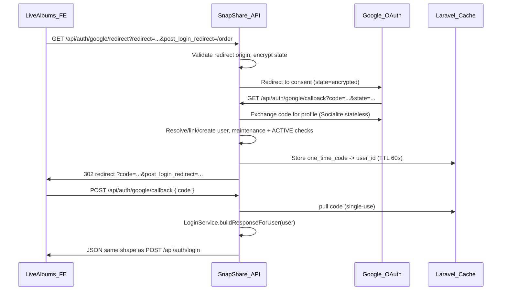

# Google SSO (OAuth 2.0) for LiveAlbums API

## Current state

- Auth lives under [`routes/groups/auth.php`](routes/groups/auth.php), mounted at `/api/auth` with `throttle:100,10` + `guest` in [`RouteServiceProvider`](app/Providers/RouteServiceProvider.php).
- Login uses [`LoginService`](app/Services/Users/LoginService.php) → Passport personal access token via `$user->createToken(...)->accessToken` (not a standalone JWT package).
- Success envelope from [`Controller::successResponse`](app/Http/Controllers/Controller.php): `{ message, status: true, data: { user: { id, first_named, first_name, last_name, email, role, expired_at, token, subscription_name } } }`.
- Users table ([`2014_10_12_000000_create_users_table.php`](database/migrations/2014_10_12_000000_create_users_table.php)): no `google_id`, `password` is NOT NULL, verification is custom via `status = PENDING` until email confirm.
- Frontend base URL already exists as `config('app.client_url')` ← `APP_CLIENT_URL` ([`config/app.php`](config/app.php)).
- CORS is already permissive (`allowed_origins: ['*']`) in [`config/cors.php`](config/cors.php); only the POST code-exchange step needs it.

## Architecture



## 1. Dependencies and config

**Install:** `composer require laravel/socialite`

**Add to [`config/services.php`](config/services.php):**
```php
'google' => [
    'client_id'     => env('GOOGLE_CLIENT_ID'),
    'client_secret' => env('GOOGLE_CLIENT_SECRET'),
    'redirect'      => env('GOOGLE_REDIRECT_URI'),
],
```

**New [`config/google.php`](config/google.php)** (keeps OAuth-specific settings out of `services.php`):
- `allowed_redirect_origins` — parsed from `APP_CLIENT_URLS` (comma-separated) falling back to `[APP_CLIENT_URL]`
- `auth_code_ttl` — default `60` seconds
- `state_ttl` — default `10` minutes

**Update [`.env.example`](.env.example):**
```
APP_CLIENT_URL=http://localhost:8080
GOOGLE_CLIENT_ID=
GOOGLE_CLIENT_SECRET=
GOOGLE_REDIRECT_URI="${APP_URL}/api/auth/google/callback"
```

Prod values: `APP_CLIENT_URL=https://snapshare-live.com`, `GOOGLE_REDIRECT_URI=https://server.snapshare-live.com/api/auth/google/callback`.

## 2. Database migration

New migration `add_google_auth_to_users_table`:

| Column | Change |
|--------|--------|
| `google_id` | nullable `string`, unique index |
| `auth_provider` | `string`, default `'email'` (values: `email`, `google`) |
| `password` | change to **nullable** |

**Model updates in [`app/Models/User.php`](app/Models/User.php):**
- Add `google_id`, `auth_provider` to `$fillable`
- Fix `setPasswordAttribute` to accept `null`/empty without bcrypt (required for OAuth-only users)
- Add helper: `isGoogleOnly(): bool` → `auth_provider === 'google'` or (`google_id` set and no password)

## 3. Refactor login response for reuse

Extract token + response building from [`LoginService`](app/Services/Users/LoginService.php) so Google exchange returns an identical payload:

```php
public function buildResponseForUser(User $user): self
{
    $this->user = $user;
    $this->isUserAuthorizedToAccess(); // ACTIVE + maintenance checks
    $this->buildUserDetails();
    return $this;
}
```

Keep existing `attempt(LoginRequest)` unchanged; Google flow calls `buildResponseForUser()` after user resolution.

## 4. New service: `GoogleAuthService`

Create [`app/Services/Auth/GoogleAuthService.php`](app/Services/Auth/GoogleAuthService.php):

| Method | Responsibility |
|--------|----------------|
| `buildRedirectUrl(string $feRedirect, ?string $postLoginRedirect)` | Validate FE redirect origin against allowlist; build encrypted `state` (redirect, post_login_redirect, nonce, exp); return Socialite redirect URL using `->stateless()->with(['state' => $encrypted])->redirect()` |
| `handleCallback(string $googleCode, string $state)` | Decrypt/validate state TTL; fetch Google user via `Socialite::driver('google')->stateless()->user()`; resolve user; store one-time code in Cache; return `{ feRedirect, authCode, postLoginRedirect }` |
| `exchangeCode(string $code)` | `Cache::pull('google_auth_code:'.$code)`; load user; delegate to `LoginService::buildResponseForUser()` |
| `resolveUser(SocialiteUser $googleUser)` | See rules below |
| `validateRedirectOrigin(string $url)` | Parse origin; must match one of `allowed_redirect_origins` |

**User resolution (exact order from spec):**
1. `User::where('google_id', $googleId)->first()` → login
2. Else `User::where('email', $email)->first()`:
   - If `google_id` already set and differs → throw conflict error
   - Else link: set `google_id`, keep `auth_provider` as `email` (linked account)
   - If user was `PENDING` → set `status = ACTIVE` (Google verified email)
3. Else create user: `role_id = USER`, names from `given_name`/`family_name`, `email`, `google_id`, `auth_provider = google`, `password = null`, `status = ACTIVE`

Apply same maintenance + `isActive()` checks as email login before issuing auth code.

**One-time code:** `Str::random(64)` stored as `Cache::put("google_auth_code:{$code}", $userId, ttl)`.

**Failure/cancel:** On any OAuth error, redirect to `{feRedirect}?error=access_denied` (recover `feRedirect` from state if possible, else fall back to `APP_CLIENT_URL/auth/google/callback`).

## 5. Controller and routes

Add methods to [`AuthController`](app/Http/Controllers/AuthController.php) (or a dedicated `GoogleAuthController` if preferred for clarity):

| Route | Handler |
|-------|---------|
| `GET google/redirect` | Read `redirect` (required) + `post_login_redirect` (optional); return Socialite redirect response |
| `GET google/callback` | Handle Google redirect; on success `redirect()->away("{$feRedirect}?code={$code}&post_login_redirect=...")` |
| `POST google/callback` | Body `{ "code": "..." }`; return `successResponse(LOGIN_SUCCESS, $loginData)` |

**Register in [`routes/groups/auth.php`](routes/groups/auth.php):**
```php
Route::get('google/redirect', [AuthController::class, 'googleRedirect']);
Route::get('google/callback', [AuthController::class, 'googleCallback']);
Route::post('google/callback', [AuthController::class, 'googleExchange'])
    ->middleware('throttle:google-auth-code');
```

**Rate limiter** in [`RouteServiceProvider`](app/Providers/RouteServiceProvider.php):
```php
RateLimiter::for('google-auth-code', fn ($req) => Limit::perMinute(10)->by($req->ip()));
```

**Form request:** [`app/Http/Requests/GoogleAuthExchangeRequest.php`](app/Http/Requests/GoogleAuthExchangeRequest.php) — `code` required string.

**Query validation for redirect:** lightweight inline validation or `GoogleRedirectRequest` — `redirect` required URL, optional `post_login_redirect` string.

## 6. Business rule updates

### Forgot password ([`UserService::forgotPassword`](app/Services/Users/UserService.php))

After finding an active user, before sending reset email:
```php
if ($user->isGoogleOnly()) {
    throw new Exception(MessagesEnum::GOOGLE_SIGNIN_REQUIRED);
}
```
Add constant to [`MessagesEnum`](app/Services/Enums/MessagesEnum.php): `GOOGLE_SIGNIN_REQUIRED = 'This account uses Google sign-in. Please sign in with Google.'`

Note: this intentionally breaks the current silent-success pattern for that case (explicit per acceptance criteria).

### Logout

No changes — [`UserService::logout`](app/Services/Users/UserService.php) already revokes the Passport token.

### Email confirmation

Google-created and Google-linked (from PENDING) users skip the flow by being set to `ACTIVE` immediately.

## 7. Security checklist

- **State:** Laravel `Crypt::encryptString(json_encode(...))` with expiry validation; reject tampered/expired state
- **Open redirect:** Strict origin allowlist (not substring match on full URL path)
- **Token never in URL:** Passport token only created on POST exchange
- **Single-use codes:** `Cache::pull` deletes after read; 60s TTL
- **Socialite stateless:** Required because `/api/auth` routes do not use `web` session middleware

## 8. Google Cloud Console setup (manual)

- OAuth 2.0 Client (Web application)
- Authorized redirect URI: `{APP_URL}/api/auth/google/callback`
- Authorized JS origins: `http://localhost:8080`, `https://snapshare-live.com`
- Scopes: `openid`, `email`, `profile` (Socialite defaults)

## 9. Frontend integration (out of scope for backend PR, required for E2E)

The LiveAlbums SPA should:
1. On "Sign in with Google": `window.location = API_URL + '/auth/google/redirect?redirect=' + encodeURIComponent(FRONTEND_URL + '/auth/google/callback') + '&post_login_redirect=' + encodeURIComponent(currentPath)`
2. At `/auth/google/callback`: read `code` or `error` from query; if `code`, `POST /api/auth/google/callback { code }`; on success call existing `Auth.login()` cookie logic; navigate to `post_login_redirect` or `/`

## 10. Manual test plan

| Scenario | Expected |
|----------|----------|
| New Google account | User created ACTIVE, POST exchange returns login-shaped JSON with token |
| Existing email user, no google_id | google_id linked, logged in |
| Existing google_id user | Logged in directly |
| PENDING email user + same Google email | Linked, status → ACTIVE, no email confirm needed |
| Google-only user → forgot password | 400 with "Use Google sign-in" message |
| Invalid/expired/reused code | 401 |
| `redirect` to evil.com | 400 before Google redirect |
| `post_login_redirect=/order` | Survives full flow in final FE redirect query param |
| Logout after Google login | Token revoked same as email login |

## Key files to create/modify

| Action | File |
|--------|------|
| Create | `app/Services/Auth/GoogleAuthService.php` |
| Create | `app/Http/Requests/GoogleAuthExchangeRequest.php` |
| Create | `config/google.php` |
| Create | `database/migrations/..._add_google_auth_to_users_table.php` |
| Modify | `app/Services/Users/LoginService.php` (extract `buildResponseForUser`) |
| Modify | `app/Http/Controllers/AuthController.php` |
| Modify | `app/Services/Users/UserService.php` (forgot-password guard) |
| Modify | `app/Models/User.php` |
| Modify | `routes/groups/auth.php` |
| Modify | `app/Providers/RouteServiceProvider.php` (rate limiter) |
| Modify | `config/services.php`, `.env.example`, `app/Services/Enums/MessagesEnum.php` |
| Modify | `composer.json` / `composer.lock` (socialite) |
