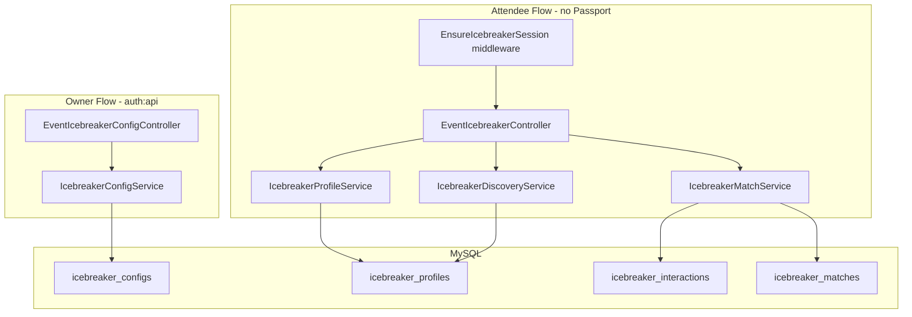

# Snapshare Connections (Icebreaker) Backend Plan

## Context & Adaptations

The PRD in [`.cursor/docs/meetup_specs.md`](c:\xampp\htdocs\SnapShare\.cursor\docs\meetup_specs.md) targets PostgreSQL + UUIDs + `/api/v1`. The live SnapShare stack is **Laravel 10 / PHP 8.1 / MySQL / Eloquent** with **Controller → Service → Model** (no repository layer). This plan adapts accordingly:

| PRD | SnapShare implementation |
|-----|--------------------------|
| UUID PKs | `bigint` auto-increment (`$table->id()`) |
| PostgreSQL ENUM types | PHP const enums extending [`BaseEnum`](c:\xampp\htdocs\SnapShare\app\Services\Enums\BaseEnum.php), stored as `unsignedTinyInteger` / `string` |
| `/api/v1/events/...` | `/api/events/...` (existing convention in [`RouteServiceProvider`](c:\xampp\htdocs\SnapShare\app\Providers\RouteServiceProvider.php)) |
| Flat JSON responses | Standard envelope via [`Controller::successResponse`](c:\xampp\htdocs\SnapShare\app\Http\Controllers\Controller.php): `{ message, status, data }` — PRD payload fields live inside `data` |
| `profile_one_id < profile_two_id` CHECK | Store `profile_low_id` / `profile_high_id` with `unique(['profile_low_id', 'profile_high_id'])` |



---

## 1. Database Schema & Migrations

Create 4 migrations following patterns in [`create_whatsapp_campaigns_table.php`](c:\xampp\htdocs\SnapShare\database\migrations\2026_05_24_000002_create_whatsapp_campaigns_table.php):

### `icebreaker_configs`
- `event_id` (PK, FK → `events.id` cascade)
- `status` (`unsignedTinyInteger`, indexed) — `IcebreakerStatusEnum`
- `allowed_intents` (`json`) — array of intent string keys, default `["ROMANCE","SOCIAL","CARPOOL"]`
- `started_at`, `ended_at`, `purged_at` (nullable datetimes)
- `timestamps`

### `icebreaker_profiles`
- `id`, `event_id` (FK cascade), `user_session_token` (`string(255)`, indexed)
- `display_name` (`string(50)`), `avatar_url` (`text`)
- `gender` (`string(20)`, nullable), `target_genders` (`json`, nullable)
- `primary_intent` (`unsignedTinyInteger`)
- `bio` (`string(150)`, nullable)
- `instagram_handle`, `whatsapp_number` — **encrypted** casts (same pattern as [`EventGuest`](c:\xampp\htdocs\SnapShare\app\Models\EventGuest.php))
- `is_active` (`boolean`, default true)
- `unique(['event_id', 'user_session_token'])`
- Composite index: `['event_id', 'primary_intent', 'is_active']` for discovery

### `icebreaker_interactions`
- `id` (bigIncrements), `event_id` (FK cascade)
- `actor_profile_id`, `target_profile_id` (FK → `icebreaker_profiles.id` cascade)
- `action` (`unsignedTinyInteger`) — LIKE / PASS
- `unique(['actor_profile_id', 'target_profile_id'])`
- Index: `['target_profile_id', 'actor_profile_id']` for reciprocal lookup

### `icebreaker_matches`
- `id`, `event_id` (FK cascade)
- `profile_low_id`, `profile_high_id` (FK cascade, ordered at write time via `min()`/`max()`)
- `unique(['profile_low_id', 'profile_high_id'])`
- `timestamps`

### Eloquent Models
- [`IcebreakerConfig`](app/Models/IcebreakerConfig.php), [`IcebreakerProfile`](app/Models/IcebreakerProfile.php), [`IcebreakerInteraction`](app/Models/IcebreakerInteraction.php), [`IcebreakerMatch`](app/Models/IcebreakerMatch.php)
- Relations on [`Event`](c:\xampp\htdocs\SnapShare\app\Models\Event.php): `icebreakerConfig()`, `icebreakerProfiles()`

### Enums (new files under `app/Services/Enums/`)
- `IcebreakerStatusEnum`: DISABLED=0, UPCOMING=1, ACTIVE=2, COOLDOWN=3, ARCHIVED=4
- `InteractionTypeEnum`: LIKE=1, PASS=2
- `MatchIntentEnum`: ROMANCE=1, SOCIAL=2, CARPOOL=3, NETWORKING=4
- `GenderEnum`: MALE, FEMALE, OTHER (string constants for validation)

---

## 2. Guest Session Middleware

New [`EnsureIcebreakerSession`](app/Http/Middleware/EnsureIcebreakerSession.php):

- Require headers `X-Event-ID` and `X-User-Session-Token`
- Validate `X-Event-ID` matches route `{event_id}` (reject 400 on mismatch)
- Validate token: non-empty, 32–255 chars, UUID-like or opaque string (regex)
- Resolve event exists; bind `icebreaker_event_id` and `icebreaker_session_token` on `Request`
- Register alias in [`app/Http/Kernel.php`](c:\xampp\htdocs\SnapShare\app\Http\Kernel.php) as `icebreaker.session`

**Session model:** client-generated opaque token (localStorage), persisted per `(event_id, user_session_token)` in `icebreaker_profiles` — no server-side session table needed for MVP.

---

## 3. API Routes

New file [`routes/groups/event_icebreaker.php`](routes/groups/event_icebreaker.php), registered in `RouteServiceProvider`:

### Attendee routes (middleware: `icebreaker.session`, no Passport)
| Method | Path | Action |
|--------|------|--------|
| GET | `{event_id}/icebreaker/config` | `getConfig` |
| POST | `{event_id}/icebreaker/profiles` | `upsertProfile` |
| GET | `{event_id}/icebreaker/discover` | `discover` |
| POST | `{event_id}/icebreaker/interact` | `interact` |
| DELETE | `{event_id}/icebreaker/profiles/me` | `deactivateProfile` |

### Owner routes (middleware: `auth:api`)
| Method | Path | Action |
|--------|------|--------|
| GET | `{event_id}/icebreaker/admin/config` | `getAdminConfig` |
| PUT | `{event_id}/icebreaker/admin/config` | `updateConfig` |

Owner endpoints use `EventService::assertEventAccess()` (same as [`EventGuestService`](c:\xampp\htdocs\SnapShare\app\Services\Guests\EventGuestService.php)).

### Form Requests
- `UpsertIcebreakerProfileRequest` — display_name (max 50), avatar_url (url), gender, target_genders (array of valid genders), primary_intent (in allowed_intents), bio (max 150), instagram_handle (max 50, regex), whatsapp_number (E.164 via existing `PhoneNormalizer` pattern)
- `IcebreakerInteractRequest` — target_profile_id (exists in event), action (LIKE|PASS)
- `DiscoverIcebreakerProfilesRequest` — limit (1–50, default 20), intent (optional)
- `UpdateIcebreakerConfigRequest` — status, allowed_intents (owner only)

---

## 4. Core Services

### `IcebreakerConfigService`
- `getPublicConfig(event_id)` — returns status, allowed_intents, `stats.total_active_profiles`; 404 if no config row
- `getAdminConfig(event_id, user_id)` / `updateConfig(...)` — owner CRUD; validate status transitions (e.g. cannot go ACTIVE without allowed_intents)
- `assertFeatureActive(event_id)` — throws if status != ACTIVE (used by profile/discover/interact)

### `IcebreakerProfileService`
- `upsertProfile(event_id, session_token, data)`:
  - Assert feature ACTIVE + intent in allowed_intents
  - Run moderation (see §6)
  - `updateOrCreate` on `(event_id, user_session_token)` — reactivates `is_active=true` on re-onboard
  - Enforce single active profile per session via unique constraint
- `deactivateProfile(event_id, session_token)` — soft opt-out: `is_active=false`, clear encrypted contact fields
- `resolveActiveProfile(event_id, session_token)` — throws if not onboarded (discover/interact gate)

### `IcebreakerDiscoveryService`
- Implements PRD §5.1 query via Eloquent/Query Builder:

```sql
-- Logical equivalent (MySQL)
WHERE event_id = ? AND is_active = 1 AND id != ?
  AND primary_intent = ?
  AND (? != ROMANCE OR (gender IN target_genders AND my_gender IN p.target_genders))
  AND NOT EXISTS (interaction actor=me, target=p)
LIMIT ?
```

- Optional `intent` query param overrides viewer's primary_intent filter
- Strip sensitive fields from response (no whatsapp/instagram)
- If zero results: include `suggest_onboarding_broadcast: true` (PRD §7.2)
- Pagination: fetch `limit + 1` rows to compute `has_more`

### `IcebreakerMatchService` — atomic `interact`
Wrapped in `DB::transaction()`:

1. Load actor + target profiles; validate same event, both active, actor != target
2. `IcebreakerInteraction::create(...)` — unique constraint catches duplicate swipes (return 409)
3. If action = PASS → return `{ match_found: false }`
4. If action = LIKE:
   - `lockForUpdate()` reciprocal row: `target → actor` with action LIKE
   - If found: `firstOrCreate` match with ordered low/high IDs; return match details (target's display_name, instagram, whatsapp)
   - Else: return `{ match_found: false }`
5. Optional: dispatch `IcebreakerMatchNotificationJob` (webhook stub for PRD §2.3 — log-only MVP)

### Controller
[`EventIcebreakerController`](app/Http/Controllers/EventIcebreakerController.php) — thin try/catch delegating to services, mirroring [`EventWhatsAppController`](c:\xampp\htdocs\SnapShare\app\Http\Controllers\EventWhatsAppController.php).

---

## 5. Error Handling

Add constants to [`MessagesEnum`](c:\xampp\htdocs\SnapShare\app\Services\Enums\MessagesEnum.php):

| Condition | HTTP | Message |
|-----------|------|---------|
| Feature not ACTIVE | 403 | `ICEBREAKER_NOT_ACTIVE` |
| No profile (discover/interact) | 422 | `ICEBREAKER_PROFILE_REQUIRED` |
| Swipe self / inactive target | 422 | `ICEBREAKER_INVALID_TARGET` |
| Duplicate swipe | 409 | `ICEBREAKER_ALREADY_INTERACTED` |
| Header mismatch / missing token | 400/401 | `ICEBREAKER_INVALID_SESSION` |
| Avatar/text moderation fail | 422 | `ICEBREAKER_CONTENT_REJECTED` |
| Intent not allowed | 422 | `ICEBREAKER_INTENT_NOT_ALLOWED` |

Services throw `Exception` with message constant; controller uses existing `errorResponse()`.

---

## 6. Content Moderation (PRD §6.1)

### Image
Reuse [`ContentModerationService::checkImage()`](c:\xampp\htdocs\SnapShare\app\Services\Moderation\ContentModerationService.php) on `avatar_url` S3 path during profile upsert. Reject if `isValid === false`.

### Text (new)
New [`ProfanityFilterService`](app/Services/Moderation/ProfanityFilterService.php):
- Config-driven word lists (`config/moderation.php` — Hebrew + English arrays)
- `containsProfanity(string $text): bool` applied to `display_name` and `bio`
- Lightweight regex word-boundary matching; no external API for MVP

---

## 7. Purge Worker (PRD §6.2)

New Artisan command `icebreaker:purge` in [`app/Console/Commands/PurgeIcebreakerDataCommand.php`](app/Console/Commands/PurgeIcebreakerDataCommand.php):

- Schedule: **hourly** in [`app/Console/Kernel.php`](c:\xampp\htdocs\SnapShare\app\Console\Kernel.php)
- Query: `icebreaker_configs` where `status = COOLDOWN` AND `ended_at < now() - 48 hours`
- Per event (transaction):
  1. Delete `icebreaker_interactions` + `icebreaker_matches` (cascade handles this, but explicit delete for clarity/logging)
  2. Anonymize profiles: null/truncate PII fields, `is_active=false`; delete S3 avatar via `FileService` if applicable
  3. Set config `status = ARCHIVED`, `purged_at = now()`

### Lifecycle hooks
Integrate with existing event commands:
- [`StartEvents`](c:\xampp\htdocs\SnapShare\app\Console\Commands\StartEvents.php): if config exists and status = UPCOMING → set ACTIVE + `started_at`
- [`EndEvents`](c:\xampp\htdocs\SnapShare\app\Console\Commands\EndEvents.php): if config status = ACTIVE → set COOLDOWN + `ended_at`

---

## 8. File Inventory (new files)

| Layer | Files |
|-------|-------|
| Migrations | 4 files in `database/migrations/` |
| Models | 4 models + Event relation update |
| Enums | 4 enum classes |
| Middleware | `EnsureIcebreakerSession` |
| Routes | `routes/groups/event_icebreaker.php` + RouteServiceProvider edit |
| Controllers | `EventIcebreakerController`, `EventIcebreakerConfigController` |
| Requests | 4 FormRequest classes |
| Services | `IcebreakerConfigService`, `IcebreakerProfileService`, `IcebreakerDiscoveryService`, `IcebreakerMatchService`, `ProfanityFilterService` |
| Commands | `PurgeIcebreakerDataCommand` |
| Jobs (optional) | `IcebreakerMatchNotificationJob` (stub) |
| Config | Extend `config/moderation.php` with profanity lists |
| Messages | ~12 new `MessagesEnum` constants |

---

## 9. Testing Strategy

Manual / feature tests (PHPUnit if project has test harness):
- Profile upsert idempotency (same session re-onboards)
- Discovery excludes self + swiped + wrong intent/gender
- Mutual LIKE creates exactly one match row (concurrent interact simulation)
- Purge command anonymizes after 48h COOLDOWN
- Owner cannot set ACTIVE with empty allowed_intents
- Header validation rejects missing/mismatched `X-Event-ID`

---

## 10. Out of Scope (MVP)

- WebSocket / SSE real-time match notifications (PRD §7.1) — stub job only
- `/api/v1` versioning
- Linking `icebreaker_profiles` to `event_guests` table (session token remains independent per PRD)
- WhatsApp push on match
