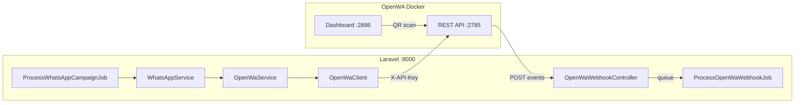

# OpenWA WhatsApp Integration Plan

## Current state

The app has **WAHA-only outbound** messaging via [`app/Services/Helpers/WhatsAppService.php`](app/Services/Helpers/WhatsAppService.php) and [`app/Jobs/ProcessWhatsAppCampaignJob.php`](app/Jobs/ProcessWhatsAppCampaignJob.php). There are **no webhooks** and **no OpenWA code** yet.

You chose to **replace WAHA** — campaigns will send through OpenWA after this work.



---

## 1. Configuration and environment

**Create** [`config/openwa.php`](config/openwa.php):

```php
return [
    'api_url'        => rtrim(env('OPENWA_API_URL', 'http://localhost:2785/api'), '/'),
    'api_key'        => env('OPENWA_API_KEY'),
    'session_id'     => env('OPENWA_SESSION_ID'),
    'webhook_url'    => env('OPENWA_WEBHOOK_URL'),
    'webhook_secret' => env('OPENWA_WEBHOOK_SECRET'),
    'webhook_id'     => env('OPENWA_WEBHOOK_ID'),
    'status'         => env('OPENWA_STATUS', 'active'), // mirrors old WAHA_STATUS kill-switch
    'idempotency_ttl' => (int) env('OPENWA_IDEMPOTENCY_TTL', 86400),
];
```

**Update** [`.env.example`](.env.example):
- Replace `WAHA_*` block with the `OPENWA_*` vars from your spec (plus `OPENWA_STATUS=active`)
- Add dev note: `php artisan serve --host=0.0.0.0 --port=8000` so Docker can reach `host.docker.internal:8000`

**Remove** [`config/whatsapp.php`](config/whatsapp.php) after refactoring `WhatsAppService` to read `config('openwa.*')`.

---

## 2. HTTP client layer — `OpenWaClient`

**Create** [`app/Services/OpenWa/OpenWaClient.php`](app/Services/OpenWa/OpenWaClient.php) (namespace grouped under `OpenWa/` alongside the service).

Responsibilities:
- Wrap `Http::withHeaders()` with required headers: `X-API-Key`, `Content-Type: application/json`, optional `X-Request-ID: req_{unix_ms}`
- Build URLs as `{api_url}/sessions/{session_id}/{path}` for session-scoped calls, or `{api_url}/{path}` for top-level
- On non-success: log response body via `LogService::init('custom')` and throw `OpenWaApiException` carrying HTTP status + decoded JSON/body
- Return decoded JSON array on success

Core method signature:

```php
public function request(string $method, string $path, ?array $body = null, bool $sessionScoped = true): array
```

**Create** [`app/Exceptions/OpenWaApiException.php`](app/Exceptions/OpenWaApiException.php) with `statusCode`, `responseBody`, and optional `errorCode` (e.g. `SESSION_NOT_READY`).

---

## 3. Business service — `OpenWaService`

**Create** [`app/Services/OpenWa/OpenWaService.php`](app/Services/OpenWa/OpenWaService.php):

| Method | OpenWA endpoint | Notes |
|--------|-----------------|-------|
| `getSessionStatus(): array` | `GET /sessions/{id}` | Return raw session payload |
| `isConnected(): bool` | uses above | `status === 'ready'` **and** phone is non-empty |
| `startSession(): array` | `POST /sessions/{id}/start` | For QR flow |
| `getQr(): array` | `GET /sessions/{id}/qr` | Optional QR retrieval |
| `checkContact(string $phone): array` | `GET /sessions/{id}/contacts/check/{number}` | Digits only |
| `registerWebhook(): array` | `POST /sessions/{id}/webhooks` | Body from config |
| `sendText(string $phone, string $text): array` | `POST .../messages/send-text` | Guard with `isConnected()` |
| `sendImage(...)` | `POST .../messages/send-image` | url or base64 variant |
| `sendVideo/Audio/Document/Location/Contact/Sticker/Bulk` | respective endpoints | Thin wrappers, same guard |

Shared helpers:
- `formatChatId(string $phone): string` — reuse [`PhoneNormalizer::validate()`](app/Services/Guests/PhoneNormalizer.php) then append `@c.us` (same logic as current `WhatsAppService`)
- `assertConnected(): void` — throws `RuntimeException` with dashboard hint when not ready

Send methods return the OpenWA response (`messageId`, `timestamp`) rather than `bool`, so callers can log message IDs.

---

## 4. Replace WAHA in `WhatsAppService`

**Refactor** [`app/Services/Helpers/WhatsAppService.php`](app/Services/Helpers/WhatsAppService.php) to become a **thin campaign-facing adapter**:

- Inject `OpenWaService` via constructor (keep `mock()` flag for tests)
- `sendText(string $phone, string $message): bool` — unchanged signature for [`ProcessWhatsAppCampaignJob`](app/Jobs/ProcessWhatsAppCampaignJob.php)
  - Skip when `config('openwa.status') !== 'active'` or mock mode (same behavior as today)
  - Call `$this->openWaService->sendText()` inside try/catch
  - Return `true` on success, `false` on any exception (preserve job semantics)
- `formatChatId()` — delegate to `OpenWaService` or `PhoneNormalizer`
- Remove all WAHA URL/session HTTP code

**Optional hardening in** [`ProcessWhatsAppCampaignJob`](app/Jobs/ProcessWhatsAppCampaignJob.php):
- Before the recipient loop, call `OpenWaService::isConnected()` once; if false, mark campaign `failed` with error `"WhatsApp not connected. Scan QR at http://localhost:2886"` and return early (avoids N failed sends)

No controller/route changes needed for campaigns — they already go through `WhatsAppService`.

---

## 5. Webhook ingress

### Route

**Create** [`routes/groups/openwa_webhook.php`](routes/groups/openwa_webhook.php):

```php
Route::post('/webhooks/openwa', [OpenWaWebhookController::class, 'handle']);
```

**Register** in [`RouteServiceProvider`](app/Providers/RouteServiceProvider.php) **without** `api` prefix (matches your `OPENWA_WEBHOOK_URL`):

```php
Route::middleware('api')->group(base_path('routes/groups/openwa_webhook.php'));
```

Using `api` middleware (not `web`) avoids CSRF entirely — same pattern as PayPlus at `/api/store/order-confirmation`. No change to [`VerifyCsrfToken`](app/Http/Middleware/VerifyCsrfToken.php) required.

### Controller

**Create** [`app/Http/Controllers/OpenWaWebhookController.php`](app/Http/Controllers/OpenWaWebhookController.php):

1. Read raw body (`$request->getContent()`) for signature verification
2. Verify HMAC: compare header/body `signature` (`sha256=...`) against `hash_hmac('sha256', $rawBody, config('openwa.webhook_secret'))` using `hash_equals`
3. Deduplicate: if `Cache::has("openwa:idempotency:{$key}")` (key from payload or `X-OpenWA-Idempotency-Key` header), return `200` immediately
4. Store key: `Cache::put(..., true, config('openwa.idempotency_ttl'))`
5. `ProcessOpenWaWebhookJob::dispatch($payload)` — pass decoded array + delivery metadata headers
6. Return `200` JSON `{"ok": true}` quickly
7. Return `401` on bad signature, `500` only when queuing fails (triggers OpenWA retry)

### Queued processor

**Create** [`app/Jobs/ProcessOpenWaWebhookJob.php`](app/Jobs/ProcessOpenWaWebhookJob.php) (`ShouldQueue`, `$tries = 3`, `failed()` logs):

Switch on `$payload['event']`:
- `message.received` — log sender/text; dispatch optional reply job (below)
- `message.sent` / `message.ack` — log delivery state (useful for future campaign ACK tracking)
- `session.status` — log disconnect/reconnect; optionally cache last status for `openwa:status`

**Create** [`app/Jobs/HandleOpenWaIncomingMessageJob.php`](app/Jobs/HandleOpenWaIncomingMessageJob.php) (optional scaffold):
- Receives normalized incoming message data
- Default: log only; easy to extend for auto-replies later

---

## 6. Artisan command — `openwa:status`

**Create** [`app/Console/Commands/OpenWaStatusCommand.php`](app/Console/Commands/OpenWaStatusCommand.php):

```
php artisan openwa:status [--register-webhook] [--start]
```

Output:
- Session ID, status, connected phone
- Connected/disconnected verdict via `isConnected()`
- QR hint (`http://localhost:2886`) when not ready
- With `--register-webhook`: call `OpenWaService::registerWebhook()`
- With `--start`: call `startSession()` then poll status up to N attempts

Follow existing command style from [`DispatchScheduledWhatsAppCampaigns`](app/Console/Commands/DispatchScheduledWhatsAppCampaigns.php) (DI in `handle()`, return `self::SUCCESS`).

---

## 7. Webhook registration payload

On `--register-webhook` or first-time setup, POST:

```json
{
  "url": "{OPENWA_WEBHOOK_URL}",
  "events": ["message.received", "message.sent", "message.ack", "session.status"],
  "secret": "{OPENWA_WEBHOOK_SECRET}"
}
```

Use the pre-provisioned `OPENWA_WEBHOOK_ID` only if the API requires it for updates; otherwise register fresh via POST.

---

## 8. Error handling conventions

Map OpenWA failures consistently in `OpenWaClient`:
- **401** — log `"Invalid OPENWA_API_KEY"`, rethrow
- **400 + SESSION_NOT_READY** — log + throw; `sendText` callers see clear message
- **400 + MESSAGE_INVALID_CHAT_ID / MESSAGE_NUMBER_NOT_ON_WHATSAPP** — log phone + body

All errors log **full response body** (matching existing `WhatsAppService` pattern).

---

## 9. Manual verification checklist

Before/after implementation, validate with curl (from your spec), then Laravel:

```bash
# Session check
curl -H "X-API-Key: dev-admin-key" http://localhost:2785/api/sessions/caabf0c0-2dd9-43e7-9485-5aeec0bbc996

# Artisan
php artisan openwa:status
php artisan openwa:status --register-webhook

# Send via tinker
app(\App\Services\OpenWa\OpenWaService::class)->sendText('972501234567', 'Hello from Laravel!');
```

Ensure Laravel listens on `0.0.0.0:8000` and OpenWA Docker can POST to `http://host.docker.internal:8000/webhooks/openwa`.

---

## Files to create / modify

| Action | File |
|--------|------|
| Create | `config/openwa.php` |
| Create | `app/Services/OpenWa/OpenWaClient.php` |
| Create | `app/Services/OpenWa/OpenWaService.php` |
| Create | `app/Exceptions/OpenWaApiException.php` |
| Create | `app/Http/Controllers/OpenWaWebhookController.php` |
| Create | `app/Jobs/ProcessOpenWaWebhookJob.php` |
| Create | `app/Jobs/HandleOpenWaIncomingMessageJob.php` |
| Create | `app/Console/Commands/OpenWaStatusCommand.php` |
| Create | `routes/groups/openwa_webhook.php` |
| Edit | `app/Services/Helpers/WhatsAppService.php` (delegate to OpenWA) |
| Edit | `app/Jobs/ProcessWhatsAppCampaignJob.php` (pre-send connection check) |
| Edit | `app/Providers/RouteServiceProvider.php` (register webhook route) |
| Edit | `.env.example` (OPENWA vars, remove WAHA vars) |
| Delete | `config/whatsapp.php` |

---

## Out of scope (follow-ups)

- Feature tests for webhook HMAC + idempotency (recommended next step)
- Campaign delivery receipts via `message.ack` webhook → update `whatsapp_campaign_guests` status
- Frontend changes ([`docs/WHATSAPP_GUEST_MESSAGING_FE.md`](docs/WHATSAPP_GUEST_MESSAGING_FE.md) stays valid — API unchanged)
