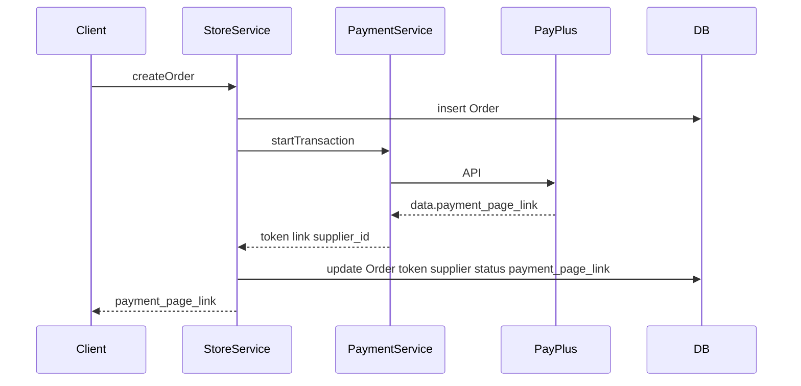

# Move payment link from subscriptions to orders

## Current state

- Pending migration `[database/migrations/2026_04_04_000001_add_payment_page_link_to_subscriptions_table.php](database/migrations/2026_04_04_000001_add_payment_page_link_to_subscriptions_table.php)` adds `payment_page_link` to `**subscriptions**`.
- `[database/seeders/SubscriptionPlanSeeder.php](database/seeders/SubscriptionPlanSeeder.php)` upserts `payment_page_link` (always `null`) for each plan.
- `[app/Services/Orders/StoreService.php](app/Services/Orders/StoreService.php)` already returns `payment_page_link` from the PayPlus transaction response in `createOrder()` but does **not** store it; the PayPlus provider still reads `payment_page_link` from the **API JSON** in `[PayPlusProvider.php](app/Services/Orders/Providers/PayPlusProvider.php)` — that is the gateway field name and stays as-is.

## Schema changes

1. `**orders`**: Add nullable `payment_page_link` (same shape as the dropped migration: `string(180)` is consistent and matches URL length).
2. `**subscriptions`**: Do **not** add / remove the column:
  - **If `2026_04_04_000001` has never been run**: Replace that migration so it only adds `payment_page_link` to `orders` (rename file/message to match, e.g. `add_payment_page_link_to_orders_table`). No subscription column is ever created.
  - **If it has already been run**: Add a new migration that `dropColumn('payment_page_link')` on `subscriptions` and `string(...)->nullable()` on `orders`, so existing databases are corrected without manual SQL.

## Application code

| Area                                                                    | Change                                                                                                                                                                                                                                                                 |
| ----------------------------------------------------------------------- | ---------------------------------------------------------------------------------------------------------------------------------------------------------------------------------------------------------------------------------------------------------------------- |
| `[app/Models/Order.php](app/Models/Order.php)`                          | Add `payment_page_link` to `$fillable`.                                                                                                                                                                                                                                |
| `[StoreService::createOrder](app/Services/Orders/StoreService.php)`     | Include `payment_page_link` => `$transaction_response['link']` in the same `$new_order->update([...])` that sets `token`, `supplier_id`, and `status` (lines 132–136). Optionally return `$new_order->payment_page_link` in the response for a single source of truth. |
| `[SubscriptionPlanSeeder](database/seeders/SubscriptionPlanSeeder.php)` | Remove `payment_page_link` from each plan row and from the `upsert` third argument column list.                                                                                                                                                                        |

No changes to `[SubscriptionController](app/Http/Controllers/SubscriptionController.php)` or `[Subscription](app/Models/Subscription.php)` beyond the DB column removal (subscriptions list will no longer expose a payment URL, which is correct).

## Data flow (after change)

## Verification

- Run migrations (or refresh) and `php artisan db:seed --class=SubscriptionPlanSeeder` / `subscriptions:seed` as you normally do.
- Create an order via the existing flow and confirm the row in `orders` has `payment_page_link` set and `subscriptions` has no such column.

