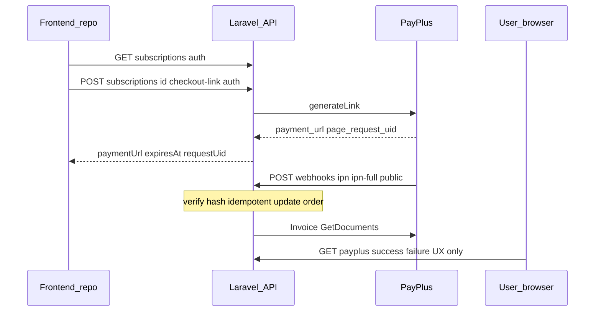

# PayPlus backend-only implementation plan

## Current codebase snapshot

- **Provider**: `[app/Services/Orders/Providers/PayPlusProvider.php](c:\xampp\htdocs\SnapShare\app\Services\Orders\Providers\PayPlusProvider.php)` calls `POST PaymentPages/generateLink` and a separate `books/docs/new/purchase` path. It uses an `Authorization` JSON header; the guide (and PayPlus REST docs) specify `**api-key` and `secret-key` headers** — this must be **verified in the official docs UI** and aligned before production.
- **Config**: `[config/payment.php](c:\xampp\htdocs\SnapShare\config/payment.php)` exposes `PAYPLUS_ADDRESS`, `PAYPLUS_API_KEY`, `PAYPLUS_SECRET_KEY`, `PAYPLUS_PAGE_UUID` — narrower than the guide’s env list in §14.
- **Order flow**: `[app/Services/Orders/StoreService.php](c:\xampp\htdocs\SnapShare\app\Services\Orders\StoreService.php)` creates an order, generates a link, then calls `**sendInvoice` before payment** — contradicts the guide (use `initial_invoice` on `generateLink`, finalize after verified IPN, then `Invoice/GetDocuments`).
- **Webhook route**: `[routes/groups/store.php](c:\xampp\htdocs\SnapShare\routes/groups/store.php)` registers `order-confirmation` under `**auth:api`** (`[RouteServiceProvider](c:\xampp\htdocs\SnapShare\app\Providers\RouteServiceProvider.php)` prefix `api/store`). **PayPlus server-to-server callbacks cannot authenticate as your users** — this must move to **public** routes with signature verification only.
- **Callback logic bug**: In `StoreService::orderConfirmed`, when `isPaymentCallbackValid` returns **true**, the code sends failure mail and throws; when **false**, it activates the order — logic is **inverted** (must be fixed when implementing webhooks).
- **Route/controller mismatch**: Store route uses `StoreController@create` but the controller only defines `createOrder` — likely broken for `POST /api/store/order` (fix alongside this work).
- **No subscriptions listing API** today; paid plans are `[SubscriptionEnum](c:\xampp\htdocs\SnapShare\app\Services\Enums\SubscriptionEnum.php)` ids 1–2 (`בסיסי`, `פרימיום`).

## Scope (backend only; guide phases 1–3, 5–7)

Skip guide **phase 4** (iframe UI, polling UX) — document the **JSON contract** for the other repo.

## 1) Configuration and HTTP client

- Extend configuration (either expand `[config/payment.php](c:\xampp\htdocs\SnapShare\config/payment.php)` or add `config/payplus.php`) to match guide §14: `PAYPLUS_ENABLED`, base URL, per-plan payment page UIDs (`PAYPLUS_PLAN_BASIC_PAYMENT_PAGE_UID`, `PAYPLUS_PLAN_PRO_PAYMENT_PAGE_UID` or map by subscription id), charge method, link expiry, `initial_invoice`, email flags, redirect URLs, public IPN URLs, merchant notification email, timeouts/skew/idempotency TTL.
- Implement `**PayplusHttpClient`** (or equivalent): base URL, required headers per verified docs, timeouts, redacted logging, normalized error handling.
- **Do not log** secrets or full card/PII; redact in debug logs.

## 2) Database (guide §9 Option B + §17)

Add migrations (names illustrative):

- `**subscription_payment_links`**: `subscription_id`, `provider`, `payment_page_uid`, `page_request_uid`, `charge_method`, `currency_code`, `amount`, `payment_url`, `expires_at`, `is_active`, optional `request_payload_json` / `response_payload_json`, `last_generated_at`, timestamps. Unique/active rules as needed for “one active cached link per subscription” (lazy generation §11).
- `**payment_attempts`**: tie each checkout to `user_id`, `subscription_id`, `order_id` (reuse existing `[orders](c:\xampp\htdocs\SnapShare\database\migrations\2024_10_23_064930_create_orders_table.php)` row as the commercial record), expected amount/currency, provider UIDs, status enum (`pending`, `paid`, `failed`, `abandoned`, `invalid_signature`, etc. per guide §12), document uid, failure fields, redirect/IPN timestamps, raw JSON columns for audit (with retention/redaction policy).
- `**payment_webhook_events`**: `dedupe_key`, `signature_valid`, `processed`, payload/headers JSON, error message — for idempotency §18.

Optional: add columns on `**orders**` for `provider_transaction_uid`, `paid_at`, if not covered by `payment_attempts` alone (pick one source of truth to avoid duplication).

## 3) Service layer (guide §10)

Introduce focused classes under e.g. `App\Services\PayPlus\`:

| Service                          | Role                                                                                                                                                                                                                                                                                                                                                                                         |
| -------------------------------- | -------------------------------------------------------------------------------------------------------------------------------------------------------------------------------------------------------------------------------------------------------------------------------------------------------------------------------------------------------------------------------------------- |
| `PayplusConfigService`           | Typed config, fail fast when `PAYPLUS_ENABLED` and required secrets/URLs missing                                                                                                                                                                                                                                                                                                             |
| `PayplusPaymentPagesService`     | `generateLink`, `disableLink`, optional `list` / `chargeMethods` for ops                                                                                                                                                                                                                                                                                                                     |
| `SubscriptionPaymentLinkService` | Lazy generate-or-reuse using `subscription_payment_links` + expiry                                                                                                                                                                                                                                                                                                                           |
| `SubscriptionCheckoutService`    | Creates/associates `payment_attempt` + order row, calls link service, returns DTO for API                                                                                                                                                                                                                                                                                                    |
| `PayplusWebhookService`          | Parse IPN/IPN FULL body, **verify `hash` using exact algorithm from [validation doc](https://docs.payplus.co.il/reference/validate-requests-received-from-payplus)** (replace/adjust current `[isHashValid](c:\xampp\htdocs\SnapShare\app\Services\Orders\Providers\PayPlusProvider.php)` logic if docs differ), idempotency, amount/currency/plan checks vs DB, transactional state updates |
| `PayplusInvoiceService`          | `POST Invoice/GetDocuments` with `filter.transaction_uid` (verify schema in docs UI), persist metadata, trigger merchant notification                                                                                                                                                                                                                                                        |

**Refactor path**: Either migrate logic out of `PayPlusProvider` into the above and keep a thin adapter implementing `[IPaymentProvider](c:\xampp\htdocs\SnapShare\app\Services\Orders\Providers\IPaymentProvider.php)`, or deprecate the provider for this flow once the new path is wired — avoid maintaining two divergent PayPlus clients.

## 4) Public vs authenticated routes (guide §15)

Register in `[RouteServiceProvider](c:\xampp\htdocs\SnapShare\app\Providers\RouteServiceProvider.php)` or a new `routes/groups/payplus.php`:

- `**POST /api/payplus/webhooks/ipn`** and `**POST /api/payplus/webhooks/ipn-full`** — **no `auth:api`**, dedicated controller; consider a relaxed or custom throttle for provider IPs.
- `**GET /payments/payplus/success**` and `**GET /payments/payplus/failure**` — under `web` middleware if you need sessions/views, or lightweight `api` GET that redirects to `config('app.client_url')` with safe query params — **UX only**, no subscription activation.

Remove or **stop using** PayPlus callbacks on `[routes/groups/store.php](c:\xampp\htdocs\SnapShare\routes/groups/store.php)` `order-confirmation` for production (that route cannot work for PayPlus as currently secured).

## 5) App-facing APIs for the other repo

- `**GET /api/subscriptions`** (auth `auth:api`): list plans from DB (`[Subscription](c:\xampp\htdocs\SnapShare\app\Models\Subscription.php)`); for each **paid** plan include checkout metadata, e.g. `checkout: { type: 'iframe_payplus', hasCachedLink: bool }` (exact shape to match FE contract).
- `**POST /api/subscriptions/{subscription}/checkout-link`** (auth): run `SubscriptionCheckoutService`, return `{ provider, paymentUrl, expiresAt, providerRequestUid }` per guide §15.

Implement a `**SubscriptionController`** (or extend an existing controller) and wire routes with `prefix('api')` consistent with the app.

## 6) `generateLink` payload (guide §6–§7, §13)

- Set `**initial_invoice = true`**, `**sendEmailApproval = true**`, `**sendEmailFailure**` per env.
- Set `**refURL_success` / `refURL_failure**` from config (FE URLs).
- Pass **customer** fields from `[User](c:\xampp\htdocs\SnapShare\app\Models\User.php)` after verifying nested field names in docs UI.
- Use **real** `amount` / line items from subscription/order — remove hardcoded `0.1` in `[setItem](c:\xampp\htdocs\SnapShare\app\Services\Orders\Providers\PayPlusProvider.php)`.
- Add `**expiry`** only after verifying exact field name/type in docs UI (`expiry_datetime` ambiguity in guide).

## 7) Webhook → business logic

- On **verified success**: mark attempt `paid`, set order `ACTIVE` (or your existing `[StatusEnum](c:\xampp\htdocs\SnapShare\app\Services\Enums\StatusEnum.php)`), store `transaction_uid`, run the same **post-payment** actions as today’s `orderConfirmed` success path (confirmed mail, `[EventService::create](c:\xampp\htdocs\SnapShare\app\Services\Events\EventService.php)` loop, etc.) — **extract** that block so both legacy (if any) and IPN call one service method inside a DB transaction.
- On **failure / invalid signature / duplicate**: no activation; record reason; idempotent no-op on duplicates.
- **Never** activate subscription from redirect endpoints alone.

## 8) Invoices and merchant email (guide §13)

- After success: call `**Invoice/GetDocuments`**, store result on `payment_attempts` (or related table).
- Send **application-level** mail to `PAYPLUS_MERCHANT_NOTIFICATION_EMAIL` with transaction uid, customer, plan, document link/metadata (use existing `[MailService](c:\xampp\htdocs\SnapShare\app\Services\Helpers\MailService.php)` / new Mailable).
- **Remove** pre-payment `books/docs/new/purchase` from the default checkout path unless you confirm it is still required alongside Payment Pages invoices.

## 9) Hardening and tests (guide §18–§19)

- Unit tests: config validation, hash verify pass/fail, idempotency, amount mismatch rejection.
- Feature tests: webhook endpoint accepts valid signature (mock secret), rejects invalid, duplicate delivery does not double-activate.
- Document for FE: base URLs, auth header, response shapes for subscriptions + checkout-link, and that **order status** should be polled until IPN confirms payment.

## 10) Pre-merge checklist (guide §22)

Explicit **VERIFY_WITH_PAYPLUS_DOCS_UI** in code for: generateLink field names, IPN payload fields, hash algorithm, `GetDocuments` response, and auth header format (`api-key`/`secret-key` vs current `Authorization` JSON).

## Risk / follow-ups

- **Subscription seed data**: `[SubscriptionSeeder](c:\xampp\htdocs\SnapShare\database\seeders\SubscriptionSeeder.php)` only inserts `id`/`name`; ensure production DB has **price**, limits, and status for the two paid plans or APIs will return incomplete data.
- **Trial plan** (`נסיון` in `[CreateOrderRequest](c:\xampp\htdocs\SnapShare\app\Http\Requests\CreateOrderRequest.php)`): exclude from PayPlus checkout-link or handle as free/demo only.

