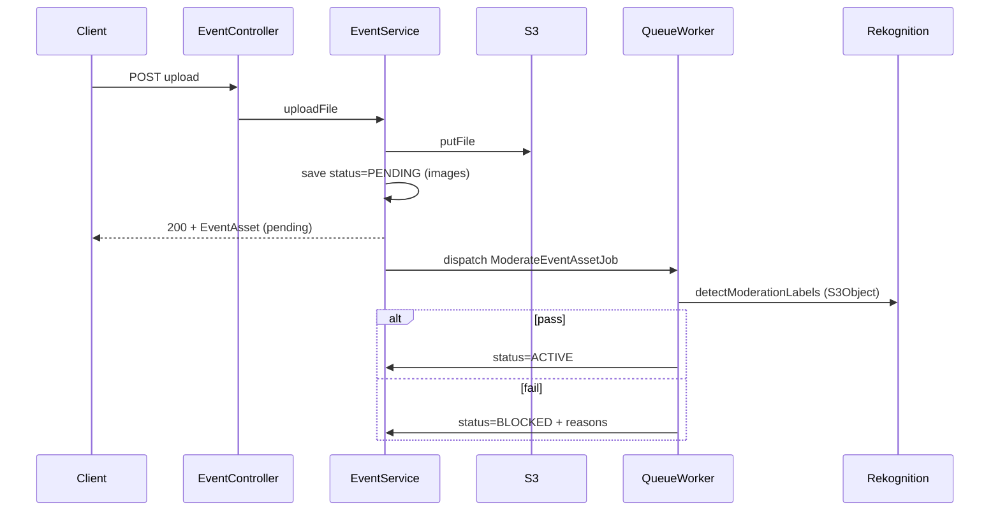

# AWS Rekognition Content Moderation Plan

## Stack & entry points

- **Backend:** Laravel 10 / PHP 8.1 ([composer.json](c:\xampp\htdocs\SnapShare\composer.json))
- **Upload:** [EventController::uploadFile](c:\xampp\htdocs\SnapShare\app\Http\Controllers\EventController.php) → [EventService::uploadFile](c:\xampp\htdocs\SnapShare\app\Services\Events\EventService.php) (lines 497–519)
- **Storage:** [FileService](c:\xampp\htdocs\SnapShare\app\Services\Helpers\FileService.php) → S3 via `league/flysystem-aws-s3-v3` (production `FILESYSTEM_DISK=s3`)
- **Asset status:** `event_assets.status` already exists; uploads currently set `StatusEnum::ACTIVE` immediately
- **Public/live filtering:** [Event::assets](c:\xampp\htdocs\SnapShare\app\Models\Event.php) and [Event::displayedAssets](c:\xampp\htdocs\SnapShare\app\Models\Event.php) already scope `where('status', StatusEnum::ACTIVE)` — pending/blocked assets will not appear on `base-assets` / live screen once upload uses `PENDING`
- **Gap:** [getEventAssetsForGallery](c:\xampp\htdocs\SnapShare\app\Services\Events\EventService.php) does **not** filter by `status` — must add `where('status', StatusEnum::ACTIVE)`
- **Frontend:** API-only (you update the client at `APP_CLIENT_URL` separately)
- **Videos:** Set `ACTIVE` immediately; no Rekognition job (per your choice)
- **Pusher:** Broadcasting is disabled/commented in this repo; live screen likely polls `GET {event_path}/base-assets`. No broadcast work required — assets appear on next poll when status becomes `ACTIVE`



---

## 1. Install AWS SDK (PHP)

`aws/aws-sdk-php` is not a direct dependency today (only transitive via Flysystem). Add it explicitly for Rekognition:

```bash
composer require aws/aws-sdk-php
```

**Credentials:** Instantiate `Aws\Rekognition\RekognitionClient` with only `version` + `region` (from `AWS_DEFAULT_REGION`). No `key`/`secret` — EC2 instance profile is used automatically. Do **not** add Rekognition keys to `.env`.

**IAM (EC2 role):** Besides `AmazonRekognitionFullAccess`, ensure `s3:GetObject` on the upload bucket (for `S3Object` input).

---

## 2. New status value: `BLOCKED`

Extend [StatusEnum](c:\xampp\htdocs\SnapShare\app\Services\Enums\StatusEnum.php):

```php
const BLOCKED = 6;
```

Reuse existing `PENDING = 2` for “awaiting moderation” on images.

| Status   | Meaning                                      | Visible on live / guest gallery |
|----------|----------------------------------------------|----------------------------------|
| PENDING  | Image uploaded, moderation in progress       | No                               |
| ACTIVE   | Passed moderation (or video upload)          | Yes (if `is_displayed`)          |
| BLOCKED  | Failed moderation                            | No                               |

---

## 3. Database migration (optional but recommended)

Add nullable column on `event_assets` for admin warnings:

- `moderation_labels` — `json`, nullable (store failed label names + confidence for admin UI)

No migration required for `status` (column already exists).

---

## 4. `ContentModerationService`

**New file:** `app/Services/Moderation/ContentModerationService.php`

Responsibilities:

- Build `RekognitionClient` without static credentials
- `checkImage(string $s3Key): array` returning `['isValid' => bool, 'reasons' => string[]]`
- Call `detectModerationLabels` with:
  - **Production:** `Image.S3Object` → `Bucket: config('filesystems.disks.s3.bucket')`, `Name: $s3Key`
  - **Local fallback:** if disk is not `s3`, use `Image.Bytes` from `FileService::get($s3Key)` (dev only)
- `MinConfidence` => `80`
- Block if any label’s **parent category** (or top-level `Name` when no parent) is in:
  - `Explicit Nudity`
  - `Violence`
  - `Visually Disturbing`

**Config (optional):** `config/moderation.php` for categories, confidence threshold, and `MODERATION_ENABLED` env flag (default `true` on production).

---

## 5. Queue job: `ModerateEventAssetJob`

**New file:** `app/Jobs/ModerateEventAssetJob.php`

Mirror pattern from [ZipEventAssetsForDownloadJob](c:\xampp\htdocs\SnapShare\app\Jobs\ZipEventAssetsForDownloadJob.php) (`ShouldQueue`, `SerializesModels`).

Logic:

1. Load `EventAsset` by ID; exit if missing or not `PENDING`
2. If `asset_type !== IMAGE_ID`, set `ACTIVE` and return (safety net)
3. Call `ContentModerationService::checkImage($asset->path)`
4. On pass: `status = ACTIVE`
5. On fail: `status = BLOCKED`, persist `moderation_labels` JSON
6. On Rekognition/API error: log via `LogService`, retry job (e.g. `$tries = 3`); after final failure, either leave `PENDING` or set `BLOCKED` with reason `"moderation_error"` — recommend **leave PENDING** + alert in logs so ops can retry

---

## 6. Integrate into upload (non-blocking)

In [EventService::uploadFile](c:\xampp\htdocs\SnapShare\app\Services\Events\EventService.php):

```php
// After save
if ($event_asset->asset_type === EventAssetTypeEnum::IMAGE_ID) {
    $event_asset->status = StatusEnum::PENDING;
    $event_asset->save();
    ModerateEventAssetJob::dispatch($event_asset->id);
} else {
    $event_asset->status = StatusEnum::ACTIVE; // videos
}
return $event_asset;
```

Controller unchanged — still returns success immediately with the asset (now `status: 2` for images).

**Quota:** Update [getEventTotalAssets](c:\xampp\htdocs\SnapShare\app\Services\Events\EventService.php) to count only `ACTIVE` + `PENDING` (exclude `BLOCKED`) so blocked uploads do not consume file limits.

---

## 7. Query / API changes (backend contract for client)

### Public & gallery (hide non-active)

| Method | Change |
|--------|--------|
| `getEventAssetsForGallery` | Add `->where('status', StatusEnum::ACTIVE)` |
| `getBaseGallery` / `displayedAssets` | Already ACTIVE-only |
| `ZipEventAssetsForDownload` | When validating asset IDs, require `status = ACTIVE` |

### Admin assets — [GET `{event_id}/assets`](c:\xampp\htdocs\SnapShare\routes\groups\event.php)

Update [EventService::getEventAssets](c:\xampp\htdocs\SnapShare\app\Services\Events\EventService.php):

- Select: add `status`, `moderation_labels` (or parsed `moderation_reasons`)
- Default: `whereIn('status', [ACTIVE, PENDING])` — hide blocked
- Query param `include_blocked=1`: also include `BLOCKED`
- Response meta (wrapper or top-level sibling): `blocked_count` — count of `BLOCKED` for this event (so client shows “Blocked images” section only when `blocked_count > 0`)

Example response shape for client team:

```json
{
  "message": "...",
  "data": {
    "assets": [...],
    "blocked_count": 3
  }
}
```

(Adjust to match existing `successResponse` structure in your `Controller` base class.)

### Upload response

Return `status` on `EventAsset` so the uploader can show “processing” until poll/refresh shows `ACTIVE`.

---

## 8. Queue worker on EC2 (required for async)

Today `.env.example` has `QUEUE_CONNECTION=sync`, which runs the job **inline** and defeats “zero delay.” On EC2:

1. Set `QUEUE_CONNECTION=database` (jobs table already exists: [create_jobs_table](c:\xampp\htdocs\SnapShare\database\migrations\2019_08_19_000000_create_jobs_table.php))
2. Run worker via Supervisor/systemd:

```bash
php artisan queue:work --sleep=3 --tries=3 --max-time=3600
```

Document in deployment notes (not committed secrets).

---

## 9. Client app checklist (separate repo — for your reference)

- **Live screen / guest gallery:** Only show `status === ACTIVE` (API already enforces on `base-assets`; gallery endpoint will too)
- **Uploader:** Optional spinner while `status === PENDING`
- **Admin event assets:** Toggle `include_blocked=1`; show warning banner when viewing blocked section; render `moderation_labels` reasons
- **Hide blocked section** when `blocked_count === 0`

---

## Files to create / modify

| Action | File |
|--------|------|
| Create | `app/Services/Moderation/ContentModerationService.php` |
| Create | `app/Jobs/ModerateEventAssetJob.php` |
| Create | `config/moderation.php` |
| Create | `database/migrations/xxxx_add_moderation_labels_to_event_assets_table.php` |
| Modify | `composer.json` (+ lock) |
| Modify | `app/Services/Enums/StatusEnum.php` |
| Modify | `app/Services/Events/EventService.php` |
| Modify | `app/Models/EventAsset.php` — cast `moderation_labels` to array |
| Modify | `app/Services/Events/ZipEventAssetsForDownload.php` (ACTIVE-only validation) |
| Modify | `.env.example` — `MODERATION_ENABLED`, note `QUEUE_CONNECTION=database` for production |

**Not in scope (this repo):** Admin/live React/Vue UI, Pusher events, video moderation.

---

## Testing plan

1. **Local:** `MODERATION_ENABLED=false` or mock service → image goes `PENDING` → job sets `ACTIVE`
2. **EC2 staging:** Upload safe image → `PENDING` → within seconds `ACTIVE` → appears on `base-assets`
3. **EC2:** Upload test image with known moderation labels → `BLOCKED` → absent from gallery, visible in admin with `include_blocked=1`
4. **Video upload:** Immediately `ACTIVE`, no job dispatched
5. Confirm queue worker is running (`php artisan queue:work`)
