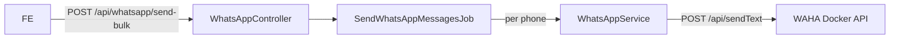

# WhatsApp Bulk Messaging — BE Implementation Plan

## Architecture Overview



## Files to Create / Edit

### 1. `.env` — add WAHA config keys
```
WAHA_STATUS=active
WAHA_BASE_URL=http://localhost:3000
WAHA_API_KEY=yoursecretkey
WAHA_SESSION=default
```

### 2. `config/whatsapp.php` — new config file
```php
return [
    'status'   => env('WAHA_STATUS', 'active'),
    'base_url' => env('WAHA_BASE_URL', 'http://localhost:3000'),
    'api_key'  => env('WAHA_API_KEY'),
    'session'  => env('WAHA_SESSION', 'default'),
];
```

### 3. `app/Services/Helpers/WhatsAppService.php` — new service (mirrors `MailService` pattern)
- Constructor: `LogService` track ID, optional `mock()` and `disable()` helpers
- `sendText(string $phone, string $message): bool` — formats phone to `PHONE@c.us`, POSTs to WAHA `POST /api/sendText` via Guzzle with `X-Api-Key` header
- Respects `WAHA_STATUS` (skips when not `active`)
- Logs success/failure per message via `LogService`

### 4. `app/Jobs/SendWhatsAppMessagesJob.php` — new queued job
- `ShouldQueue`, `$tries = 3`
- Constructor receives `array $phones`, `string $message`
- `handle(WhatsAppService $whatsapp)` — iterates phones, calls `sendText()` per number, logs failures without stopping the loop
- `failed()` — logs job failure

### 5. `app/Http/Requests/SendWhatsAppRequest.php` — new Form Request
- `phones`: required array, min 1 item, each item is a string (phone number)
- `message`: required string, min 1 char, max 4096 chars

### 6. `app/Http/Controllers/WhatsAppController.php` — new controller
- `sendBulk(SendWhatsAppRequest $request)` — dispatches `SendWhatsAppMessagesJob`, returns `202` success response

### 7. `routes/groups/whatsapp.php` — new route group file
```php
Route::post('send-bulk', [WhatsAppController::class, 'sendBulk']);
```

### 8. `app/Providers/RouteServiceProvider.php` — register new route group
Add a new `Route::middleware('auth:api')->prefix('api/whatsapp')->group(...)` for the new route file.

### 9. `app/Services/Enums/MessagesEnum.php` — add new message constant
```php
const WHATSAPP_MESSAGES_QUEUED = 'WhatsApp messages queued successfully';
```

---

## Request / Response Contract

**`POST /api/whatsapp/send-bulk`** (auth: `auth:api`)

Request body:
```json
{
  "phones": ["972501234567", "972521234567"],
  "message": "Hello from SnapShare!"
}
```

Response `202`:
```json
{
  "message": "WhatsApp messages queued successfully",
  "data": { "queued": 2 }
}
```

---

## FE Developer Prompt

> **Task:** Build a "Send WhatsApp Blast" UI feature in SnapShare.
>
> **Endpoint:** `POST /api/whatsapp/send-bulk` (requires Bearer token auth)
>
> **Request body:**
> ```json
> { "phones": ["972501234567", ...], "message": "Your custom message" }
> ```
>
> **UI requirements:**
> - A form with a **phone number list** input (allow adding/removing numbers, each must be a valid international number without `+`) and a **message** textarea (max 4096 chars with live counter).
> - A "Send" button that is disabled while submitting.
> - On success (`202`) show a toast: "Messages queued for N recipients".
> - On validation error (`422`) highlight the specific fields.
> - The form should be accessible from the admin/dashboard area.
> - Numbers can also be pasted as a comma- or newline-separated list and auto-split into individual entries.
