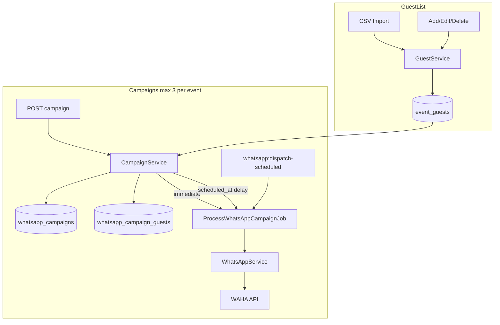

# WhatsApp Guest List & Messaging Feature

## Context

SnapShare already has a thin WhatsApp layer (`[WhatsAppService.php](app/Services/Helpers/WhatsAppService.php)`, `[SendWhatsAppMessagesJob.php](app/Jobs/SendWhatsAppMessagesJob.php)`, `[POST /api/whatsapp/send-bulk](routes/groups/whatsapp.php)`) that accepts raw phone arrays. This plan replaces that flow with a **persistent, encrypted guest list per event** and **campaign-based sending** (max **3 sends per event**).

The frontend lives in a separate SPA (`APP_CLIENT_URL`); this plan covers **backend API + FE spec only**.

---

## Architecture




---

## Database Schema

### 1. `event_guests`


| Column                    | Type        | Notes                                                           |
| ------------------------- | ----------- | --------------------------------------------------------------- |
| `id`                      | bigint PK   |                                                                 |
| `event_id`                | FK → events | indexed                                                         |
| `full_name`               | text        | Laravel `encrypted` cast                                        |
| `phone`                   | text        | Laravel `encrypted` cast                                        |
| `phone_hash`              | char(64)    | SHA-256 of normalized digits; used for dedup without decrypting |
| timestamps + soft deletes |             |                                                                 |


Unique index: `(event_id, phone_hash)` to prevent duplicate numbers per event.

### 2. `whatsapp_campaigns`


| Column                                          | Type              | Notes                                                                         |
| ----------------------------------------------- | ----------------- | ----------------------------------------------------------------------------- |
| `id`                                            | bigint PK         |                                                                               |
| `event_id`                                      | FK                |                                                                               |
| `user_id`                                       | FK                | creator                                                                       |
| `message`                                       | text              | max 4096 chars                                                                |
| `send_mode`                                     | enum              | `immediate`, `scheduled`                                                      |
| `scheduled_at`                                  | datetime nullable | required when scheduled                                                       |
| `status`                                        | tinyint           | `pending`, `queued`, `sending`, `completed`, `partial`, `failed`, `cancelled` |
| `recipient_count`, `sent_count`, `failed_count` | int               | denormalized counters                                                         |
| `queued_at`, `started_at`, `completed_at`       | datetime nullable |                                                                               |
| timestamps                                      |                   |                                                                               |


**3-send limit:** count campaigns where `status NOT IN (cancelled)` for the event. Block creation when count >= 3.

### 3. `whatsapp_campaign_guests` (pivot + delivery tracking)


| Column                    | Type              | Notes                         |
| ------------------------- | ----------------- | ----------------------------- |
| `campaign_id`, `guest_id` | FKs               | composite PK                  |
| `status`                  | tinyint           | `pending`, `sent`, `failed`   |
| `sent_at`                 | datetime nullable |                               |
| `error_message`           | text nullable     | never include decrypted phone |


---

## Encryption & Security

Follow existing project pattern (`Crypt` via Laravel casts — same family as `[GoogleAuthService.php](app/Services/Auth/GoogleAuthService.php)`):

```php
// EventGuest model
protected $casts = [
    'full_name' => 'encrypted',
    'phone'     => 'encrypted',
];
```

Additional rules:

- Store `phone_hash = hash('sha256', normalized_digits)` on create/update for dedup lookups.
- **Never log** decrypted names/phones in `LogService` — log only `guest_id`, `campaign_id`, counts.
- All endpoints require `auth:api` + event ownership via existing `[EventService::isAuthorizedToAccessEvent()](app/Services/Events/EventService.php)` (extract to a public `assertEventAccess(int $eventId, int $userId): Event` helper so WhatsApp services can reuse it).
- CSV import: validate phone format (`/^\d{7,15}$/` after normalization), reject rows with missing columns, cap file size (e.g. 2MB / 5000 rows).

---

## Services

### `EventGuestService` (`app/Services/WhatsApp/EventGuestService.php`)

- `list(int $eventId, int $userId)` — paginated guest list (decrypted for authorized owner)
- `create`, `update`, `delete` — single-record CRUD
- `importFromCsv(int $eventId, int $userId, UploadedFile $file)` — parse CSV with headers `full_name`, `phone` (case/space tolerant); upsert or skip duplicates by `phone_hash`; return `{ imported, skipped, errors[] }`
- `getTemplateCsv()` — return downloadable template content

Phone normalization helper (shared): strip non-digits, validate length — reuse logic from `[WhatsAppService::formatChatId()](app/Services/Helpers/WhatsAppService.php)`.

### `WhatsAppCampaignService` (`app/Services/WhatsApp/WhatsAppCampaignService.php`)

- `list(int $eventId, int $userId)` — campaigns + `remaining_sends` (3 - active count)
- `create(int $eventId, int $userId, array $data)`:
  - Enforce 3-send limit
  - Resolve recipients: if `guest_ids` omitted or empty → all event guests; else validate IDs belong to event
  - Require at least 1 recipient
  - Create campaign + pivot rows
  - **Immediate:** dispatch `ProcessWhatsAppCampaignJob` now, set status `queued`
  - **Scheduled:** set status `pending`, dispatch job with `->delay($scheduledAt)` (requires `database` or `redis` queue in production — note in deployment docs)
- `cancel(int $campaignId, int $userId)` — only if `pending` (not yet dispatched)
- `find(int $campaignId, int $userId)` — detail with per-guest delivery status

### Refactor job: `ProcessWhatsAppCampaignJob`

Replace phone-array job as the primary path:

- Load campaign + pending pivot rows + guests
- Set status `sending`, iterate guests, decrypt phone, call `WhatsAppService::sendText()`
- Update per-guest status; finalize campaign as `completed` / `partial` / `failed`
- Keep `[SendWhatsAppMessagesJob](app/Jobs/SendWhatsAppMessagesJob.php)` temporarily (or mark deprecated) — no longer used by new API

### Scheduler safety net

Add `whatsapp:dispatch-scheduled` command (runs every minute in `[Kernel.php](app/Console/Kernel.php)`):

- Find campaigns with `status = pending`, `scheduled_at <= now()`
- Dispatch job for any not yet queued (covers missed delayed jobs)

---

## API Endpoints

New route file `[routes/groups/event_whatsapp.php](routes/groups/event_whatsapp.php)`, registered in `[RouteServiceProvider.php](app/Providers/RouteServiceProvider.php)`:

```
/api/events/{event_id}/whatsapp/guests              GET     list guests
/api/events/{event_id}/whatsapp/guests              POST    add guest
/api/events/{event_id}/whatsapp/guests/import         POST    CSV upload (multipart)
/api/events/{event_id}/whatsapp/guests/import-template GET   download CSV template
/api/events/{event_id}/whatsapp/guests/{guest_id}   PUT     update guest
/api/events/{event_id}/whatsapp/guests/{guest_id}   DELETE  remove guest

/api/events/{event_id}/whatsapp/campaigns           GET     list campaigns + remaining_sends
/api/events/{event_id}/whatsapp/campaigns           POST    create send
/api/events/{event_id}/whatsapp/campaigns/{id}      GET     campaign detail
/api/events/{event_id}/whatsapp/campaigns/{id}/cancel POST  cancel pending scheduled send
```

All routes: `middleware('auth:api')`.

### Key request/response contracts

**POST campaign** (create send):

```json
{
  "message": "Hello from our event!",
  "send_mode": "immediate",
  "guest_ids": [1, 2, 5]
}
```

- `guest_ids` optional — omit or pass all IDs = everyone selected (FE default: all checked)
- `send_mode: "scheduled"` requires `scheduled_at` (ISO 8601, must be future)

**POST campaign response** `202`:

```json
{
  "message": "WhatsApp campaign queued successfully",
  "data": {
    "campaign": { "id": 1, "status": "queued", "recipient_count": 42 },
    "remaining_sends": 2
  }
}
```

**GET guests response:**

```json
{
  "data": {
    "guests": [{ "id": 1, "full_name": "Jane Doe", "phone": "972501234567" }],
    "total": 42
  }
}
```

**GET campaigns response** includes `remaining_sends` and history with counts.

Add new constants to `[MessagesEnum.php](app/Services/Enums/MessagesEnum.php)`: guest CRUD success, import success, campaign queued/scheduled/cancelled, `WHATSAPP_SEND_LIMIT_REACHED`, `WHATSAPP_NO_GUESTS`, etc.

---

## Form Requests


| Request                         | Key rules                                                                                                                                                          |
| ------------------------------- | ------------------------------------------------------------------------------------------------------------------------------------------------------------------ |
| `StoreEventGuestRequest`        | `full_name` required string; `phone` required, normalized digits 7–15                                                                                              |
| `UpdateEventGuestRequest`       | same fields, optional                                                                                                                                              |
| `ImportEventGuestsRequest`      | `file` required, mimes:csv,txt, max 2048KB                                                                                                                         |
| `CreateWhatsAppCampaignRequest` | `message` required max 4096; `send_mode` in immediate/scheduled; `scheduled_at` required_if scheduled, after:now; `guest_ids` optional array of existing guest IDs |


---

## CSV Import Details

Expected columns (header row required):

```
full_name,phone
Jane Doe,972501234567
```

- Accept flexible header aliases: `name`, `full name`, `phone`, `phone number`, `mobile`
- Normalize phone: strip `+`, spaces, dashes
- Return row-level errors (e.g. row 5: invalid phone) without aborting entire import
- Provide `GET import-template` returning `Content-Disposition: attachment` with the sample above

No new Composer packages needed — use native `fgetcsv()`.

---

## Model Updates

- New models: `EventGuest`, `WhatsAppCampaign`, `WhatsAppCampaignGuest`
- Add to `[Event.php](app/models/Event.php)`:
  - `guests()` hasMany EventGuest
  - `whatsappCampaigns()` hasMany WhatsAppCampaign

---

## Deprecation of existing endpoint

`[POST /api/whatsapp/send-bulk](routes/groups/whatsapp.php)` becomes redundant. Options:

- **Recommended:** remove route + controller method after new API is wired (keep `WhatsAppService` and refactor job)
- If needed short-term: leave endpoint but document as deprecated in FE spec

---

## FE Developer Spec (for separate SPA)

c

---

## Deployment Notes

- **Queue driver:** scheduled sends require a persistent queue (`database` or `redis`), not `sync`. Run `php artisan queue:work` in production.
- **Scheduler:** ensure cron runs `schedule:run` every minute (already required for event lifecycle commands).
- **APP_KEY:** must remain stable — Laravel encrypted columns become unreadable if key rotates without re-encryption migration.

---

## Files to Create / Edit


| Action         | File                                                                          |
| -------------- | ----------------------------------------------------------------------------- |
| Create         | 3 migrations (guests, campaigns, campaign_guests)                             |
| Create         | Models: `EventGuest`, `WhatsAppCampaign`, `WhatsAppCampaignGuest`             |
| Create         | `EventGuestService`, `WhatsAppCampaignService`                                |
| Create         | `ProcessWhatsAppCampaignJob`                                                  |
| Create         | `DispatchScheduledWhatsAppCampaigns` command                                  |
| Create         | `EventWhatsAppController` (or split Guest + Campaign controllers)             |
| Create         | 4 Form Requests                                                               |
| Create         | `routes/groups/event_whatsapp.php`                                            |
| Edit           | `RouteServiceProvider`, `Event` model, `Console/Kernel`, `MessagesEnum`       |
| Edit/Deprecate | `WhatsAppController`, `routes/groups/whatsapp.php`, `SendWhatsAppMessagesJob` |


